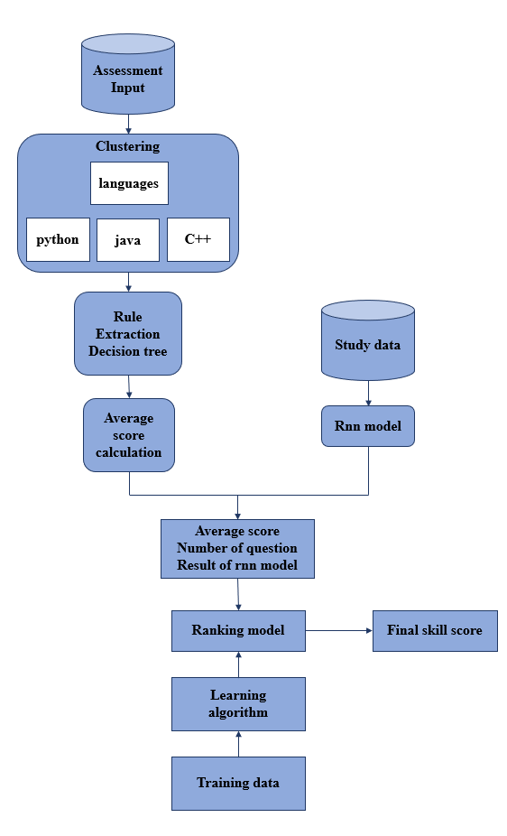
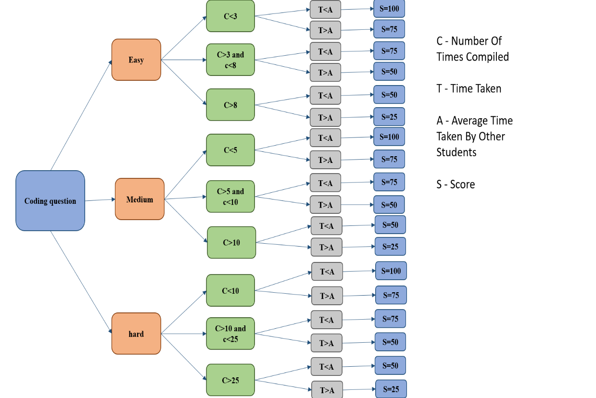

# PROGRAMMING-SKILL-SCORE-PREDICTION
## TABLE OF CONTENTS ##
*	Introdution
*	Data preprocessing
*	Clustering
*	Rule extraction
*	RNN model
*	Ranking model
*	Result
## INTRODUCTION: ##
The programming capability of students is measured based on two factors that is their interest and ability to learn and their performance in assessments. We use  efficient algorithm to calculate the score in each step.
## DATA PREPROCESSING : ##
The given data is organized as per the requirement and  divided in to assessment data and study data. The assessment data consists of datas like number of tests attended,score in each test, number od questions in each test ,programming language used ,etc,. The study data consits of number of learning videos seen, number of practice tests attended and score in each practice test. Data cleaning and Attribute selection is done to organized the data as shown in fig 1.1 .
 

  Fig 1.1 

## BASIC FLOW ##
 

  Fig 1.2 

## CLUSTERING: ##
The assessment data is clustered  based on the programming language used by the student. K-means clustering is used to cluster the data. 
### Steps involved: ###
*	Creating and populating working tables
*	Initializing K-means
*	Computing Euclidean distance
*	Finding the nearest centroid
*	Updating clustering results

  Fig 1.3

### Reason for choosing K-means clustering: ###
1.	Relatively simple to implement.
2.	Scales to large data sets.
3.	Guarantees convergence.
4.	Generalizes to clusters of different shapes and sizes, such as elliptical clusters.
## RULE EXTRACTION: ##
Each question data in the cluster is fed to the decision tree for calculating each question score. A decision tree is a decision support tool that uses a tree-like graph or model of decisions and their possible consequences, including chance event outcomes, resource costs, and utility. First the questions are classified as coding and MCQ questions . Then fed to the decision tree for calculating the score. Average score is calculated at last for further calculations. The decision tree is constructed as shown in Fig 1.4.

### Reasoning for choosing decision tree: ###
*	Compared to other algorithms decision trees requires less effort for data preparation during pre-processing.
*	A decision tree does not require normalization of data.
*	A decision tree does not require scaling of data as well.
*	Missing values in the data also does NOT affect the process of building decision tree to any considerable extent.
*	A Decision trees model is very intuitive and easy to explain to technical teams as well as stakeholders.

  
  

  Fig 1.4

## RNN MODEL: ##
The study data of the student is fed to the RNN model to calculate the score based on the students study pattern and practice test scores. This model is used to measure the learning capacity of the students. Analysing the learning capacity of the student is equally important for calculating the skill score. Basic RNN architecture is shown in fig 1.5.
  

  Fig 1.5

### Reason for choosing RNN: ###
*	RNN can process inputs of any length.
*	An RNN model is modelled to remember each information throughout the time which is very helpful in any time series predictor.
*	Even if the input size is larger, the model size does not increase.
*	The weights can be shared across the time steps.

## RANKING MODEL: ##
The average decision tree scores, total number of questions attended by the student in assessments in each programming language and score calculated by RNN based on the learning capacity is given as input to the ranking model to list the programming languages based on the students efficiency with the final skill score for each language.

## RESULT : ##
The ability to predict an individual’s potential to learn programming concepts is important for many reasons . The extracted rules confirm the important’ s of variables such as difficulty level ,time taken and learning ability. Accurate and comprehensible solution is obtained with less time complexity. The final results of the ranking model is normalized and the skill score for each language is displayed in percentage.
## REFERENCE : ##
* https://link.springer.com/article/10.1186/s41039-018-0075-y
* https://pdfs.semanticscholar.org/eadc/78702c1ccb894dfb7a619c2143ef3868f2d5.pdf
* https://github.com/tarunshah/Student-Analysis
* https://www.researchgate.net/publication/259520005_Calculation_of_average_coding_efficiency_based_on_subjective_quality_scores
* https://www.researchgate.net/publication/261268264_Predicting_Students'_Performance_in_an_Introductory_Programming_Course_Using_Data_from_Students'_Own_Programming_Process
